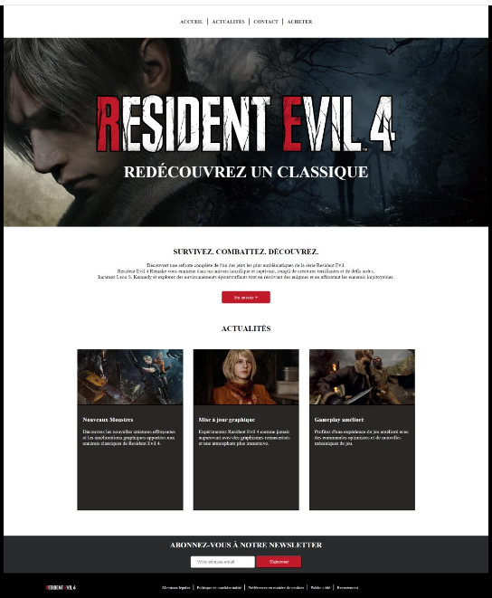

# Resident Evil 4

Création d'une page web statique basée sur une maquette de "Resident Evil 4", en respectant les principes du responsive design pour une adaptabilité sur tous les appareils.

## 🌐 Technologies appliquées

- 
- 

## 🛠️ Outils

- 

## 📷 Captures d’écran

## 🔗 Liens vers la démo

